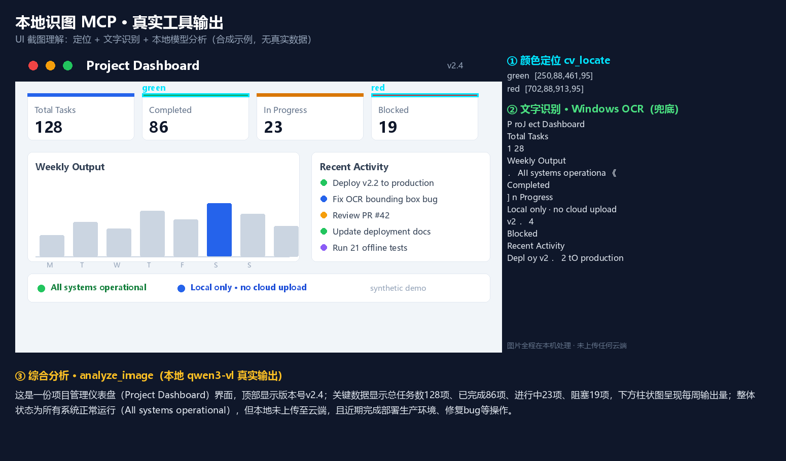
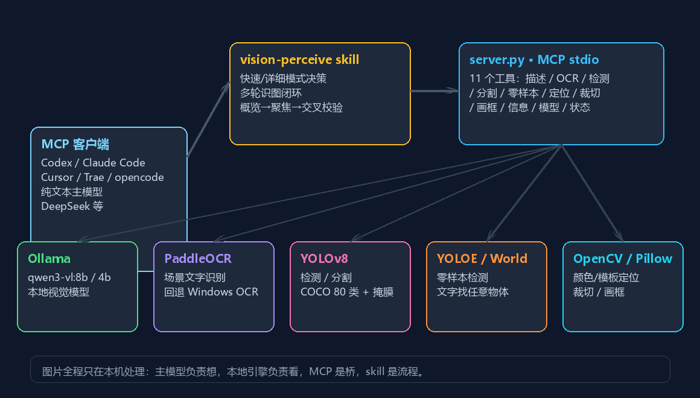

# Local Vision MCP（本地识图）

给纯文本模型（DeepSeek 等）补上本地"看图"能力：MCP 优先、命令行兜底，图片全程不出本机。

[English](README.en.md) | 简体中文

> **Give pure-text LLMs (DeepSeek, Claude, Codex, etc.) local vision.** Image files and vision processing stay on your machine — a local Ollama vision model, PaddleOCR text recognition, YOLO detection/segmentation, and OpenCV locating return text and coordinates. Raw images are never uploaded directly. Full English docs: [README.en.md](README.en.md)

**图片文件与视觉识别全程在本机完成**：读取本地图片 → 本地 Ollama 视觉模型 / YOLO / PaddleOCR / OpenCV → 返回文字与坐标，原始图片不直接上传。
识别出的文字会进入主模型对话——若主模型为云端 API（如 DeepSeek），该文字内容会上云；需要完全隔离可搭配本地主模型。


## 特性

- 🖼️ **本地看图**：图片文件与视觉识别全程在本机完成，不直接上传原图；识别出的文字随对话交给主模型（云端主模型可见）
- 🔧 **专业工具分工**：视觉模型描述、PaddleOCR 场景文字识别（含坐标框）、YOLO 检测/分割、零样本检测、颜色/模板定位、裁切放大，各管一段
- 🔄 **多轮识图闭环**：概览 → 聚焦 → 文字 → 定位 → 放大 → 交叉校验 → 综合报告，过滤幻觉
- ⚡ **快慢双模式**：顺手附图走 quick（默认 4B、秒级返回），认真分析走 detailed（8B）
- 🧠 **健壮性**：相同图片+参数自动缓存（秒回）、Ollama 瞬时故障自动重试、图片内容按"不可信数据"处理（防提示注入）、`vision_status` 一键排障
- 🛡️ **部署友好**：server 零依赖起步；PaddleOCR / YOLOE 等重型能力可选、自动降级；下载支持断点续传与完整性校验
- 📦 **开箱脚本**：环境自检、MCP 注册、skill 安装、可选依赖一键装

## 效果演示

同一张看板截图的**真实工具输出**：`cv_locate` 颜色定位（绿/红卡片色条）+ PaddleOCR 文字识别（含坐标）+ 本地 qwen3-vl 综合分析（图片文件在本机处理）：



## 为什么有这个东西

DeepSeek 等纯文本模型没有视觉能力，但通过 MCP 工具可以获得"看图"能力：由本地视觉模型负责"看"，主模型负责"想"。
本项目把看图拆成多个专业工具（描述、OCR、检测、定位、裁切放大），再用多轮闭环 skill 串起来，解决单次调用漏细节、位置说不准、幻觉等问题。

## 原理



一句话：**主模型负责"想"，本地引擎负责"看"，MCP 是桥，skill 是流程**；图片文件与视觉识别在本机完成。

数据流：纯文本主模型（Codex / Claude Code / opencode / DeepSeek 等）→ `server.py`（MCP stdio，12 个工具）→
本地引擎（Ollama 视觉模型 / PaddleOCR / YOLO / OpenCV / Pillow）→ 返回文字与坐标 → 主模型交叉校验并输出最终报告。

## 文件

```
server.py                  MCP 服务器本体（单文件，基础零依赖）
call_tool.py               命令行调用工具（MCP 不可用时的 CLI 兜底）
register_mcp.py            安全注册 MCP 的 Python 实现
check_mcp.py               MCP 连通性握手探针
AGENTS.md                  识图规范（Codex 自动加载，场景 → 工具映射）
win_ocr.ps1                Windows 内置 OCR 调用脚本
skills/vision-perceive/    多轮识图闭环 skill
tests/                     离线单元测试 + 真机冒烟测试
docs/                      架构说明 / 部署手册 / 开发记录
check.ps1                  环境自检
setup.ps1 / install.ps1 / install-extra.ps1 / register-mcp.ps1 / install-skill.ps1   安装与注册脚本
examples/                  合成示例图与展示图（demo_input / demo_annotated / social_preview / architecture）
benchmarks/                 可复现基准测试（合成用例 + 指标报告，见「测试」一节）
LICENSE / CHANGELOG.md / CONTRIBUTING.md / requirements.txt
```

## 环境要求

- Python 3.9+
- [Ollama](https://ollama.com) 已安装并启动，视觉模型：`ollama pull qwen3-vl:8b`
- 可选：`python -m pip install -r requirements.txt`（Pillow / ultralytics / numpy）

## 安装（两种方式，任选其一）

> 安装完成后**重启 Codex** 即可使用。下方"工具/功能/排障"等章节均为参考材料，**安装阶段不必通读**。

### 方式一：一键安装（推荐）

```powershell
# 基础安装（描述 / 检测 / 分割 / OCR 兜底）
powershell -ExecutionPolicy Bypass -File setup.ps1

# 完整安装（+ PaddleOCR 场景文字 / YOLOE 零样本，需联网，体积较大）
powershell -ExecutionPolicy Bypass -File setup.ps1 -Extras
```

`setup.ps1` = 环境检查 +（可选依赖）+ 注册 MCP + 安装 skill 的整合脚本，可重复执行（幂等）。

> ⚠️ 注册 MCP 前请**先完全退出 Codex 桌面应用**，注册完再启动；运行中的应用可能用旧配置覆盖你的修改。`register-mcp.ps1` 检测到 Codex 在运行时会自动中止。

### 方式二：分步安装（想看清每一步）

```powershell
# 0. 环境准备（一次性）
#    安装 Python 3.9+（https://www.python.org/downloads/）
#    安装并启动 Ollama（https://ollama.com）
ollama pull qwen3-vl:8b

# 1. 自检环境
powershell -ExecutionPolicy Bypass -File check.ps1

# 2.（可选）安装 PaddleOCR / CLIP（不装则 OCR 自动回退 Windows OCR）
powershell -ExecutionPolicy Bypass -File install-extra.ps1

# 3. 注册 MCP（只追加 local_vision，不会动你已有的 DeepSeek 配置）
powershell -ExecutionPolicy Bypass -File register-mcp.ps1

# 4. 安装识图 skill
powershell -ExecutionPolicy Bypass -File install-skill.ps1

# 5. 重启 Codex，然后说：分析这张图 C:/xxx/photo.png
```

## 工具

| 工具 | 用途 |
|---|---|
| `analyze_image` | 本地视觉模型分析图片；`mode=quick` 快速精简输出（默认 4B，自动回退）、`mode=detailed` 完整（默认 8B）；`file_paths` 多张图会逐张分析后合并返回（每张都完整看）；`num_ctx`/`temperature` 可调 |
| `compare_images` | 用户明确要求对比时用：多张图按图1/图2…编号拼成一张网格图，一次分析异同（拼接会缩小单图，细节请逐张 `analyze_image`） |
| `image_info` | 读取尺寸/格式/大小，确定坐标系 |
| `ocr_extract` | 文字提取；`engine=auto` 优先 PaddleOCR，否则 Windows OCR（含位置） |
| `detect_objects` | YOLO 检测 COCO 80 类，返回类别/置信度/坐标框；可 `save_path` 存标注图 |
| `segment_objects` | YOLO 分割（默认 yolov8n-seg.pt）：像素级掩膜 + 面积统计，遮挡数人/遥感量算用 |
| `detect_by_text` | YOLOE / YOLO-World 零样本检测：用文字描述找任意物体 |
| `cv_locate` | 颜色定位（mode=color）或模板匹配（mode=template） |
| `crop_image` | 裁切 + 放大局部区域，小字/小目标二次识别 |
| `draw_bounding_box` | 一次画多个框（boxes 数组），可视化验证 |
| `list_local_models` | 查看本机 Ollama 模型 |
| `vision_status` | 排障：版本、Ollama 连通性、模型就绪、可选依赖、缓存/重试配置 |

## 命令行直接用（CLI 兜底）

如果客户端没有把 MCP 工具注入当前会话（工具列表里看不到 `analyze_image` / `ocr_extract` 等），
可以直接用命令行调用同一套本地工具，效果与 MCP 完全等价：

```powershell
python call_tool.py <工具名> '<JSON 参数>'
```

示例：

- 看图说话：`python call_tool.py analyze_image '{"file_path":"C:/x.png","mode":"quick"}'`
- 提取文字：`python call_tool.py ocr_extract '{"file_path":"C:/x.png","engine":"auto"}'`
- 数人/找物体：`python call_tool.py detect_objects '{"file_path":"C:/x.png","classes":["person"]}'`

不带参数运行会列出全部 12 个工具。`vision-perceive` skill 已内置该兜底：MCP 工具不可用时自动改用 CLI，
不会因为客户端没注入工具而跳过识图。

## 定位工具箱（该用哪个）

| 场景 | 工具 | 示例 |
|---|---|---|
| 数人、找常见物体 | `detect_objects` | `classes=["person"]` |
| 遮挡严重数人、面积量算 | `segment_objects` | `classes=["person"]`（掩膜更准） |
| 找任意物体 | `detect_by_text` | `text="消防栓, 蓝色帐篷"` |
| 找图例色块 | `cv_locate` | `mode="color", color="#3b6ea5"` |
| 找图标/logo | `cv_locate` | `mode="template", template_path=图标.png` |
| 小字/小目标 | `crop_image` | `scale=3` 后重新 OCR/分析 |
| 验证框准不准 | `draw_bounding_box` + `analyze_image` | 画框后让视觉模型确认 |

中文描述会自动本地翻译成英文再检测（常见物体走词典直译，其余走本地 Ollama 翻译；`LOCAL_VISION_ZS_TRANSLATE=0` 可关闭）。

## 多轮识图闭环（vision-perceive skill）

收到图片分析请求时，按 skill 流程执行而不是单次调用：
概览 → 聚焦 → 文字提取 → 精确定位 → 局部放大 → 交叉校验 → 综合报告。
多轮一致的内容可信度高，单轮幻觉会被过滤；小字小目标强制先放大再识别。

**如何唤起**
- **显式唤起**：对话里输入 `@vision-perceive` 后跟图片请求（例如 `@vision-perceive 分析这张图`），强制按该流程执行；
- **自动生效**：以本目录为工作区的新对话，[AGENTS.md](AGENTS.md) 会自动注入识图规范（含 CLI 兜底），无需任何前缀。

## 目标检测依赖

```powershell
python -m pip install ultralytics
```

- `detect_objects` 默认 `yolov8n.pt`（首次自动下载约 6MB，可 `DETECTION_MODEL` 换 `yolov8s.pt` 等）
- `detect_by_text` 默认 `yoloe-v8s-seg.pt`（首次自动下载约 30MB），也可换 `yolov8s-world.pt`

`detect_by_text`（YOLOE）还需要 CLIP 文本编码依赖，否则会报 `No module named 'clip'`：

```powershell
python -m pip install git+https://github.com/ultralytics/CLIP.git
```

GitHub 不通时用镜像（任选其一）：

```powershell
python -m pip install git+https://ghproxy.net/https://github.com/ultralytics/CLIP.git
python -m pip install git+https://ghfast.top/https://github.com/ultralytics/CLIP.git
```

首次调用 YOLOE 还会联网下载 CLIP 权重（ViT-B/32，约 300MB）。

另外 YOLOE 的文本编码器需要 MobileCLIP 的 TorchScript 权重 `mobileclip_blt.ts`（约 530MB）。服务端会在首次调用
`detect_by_text` 时**后台**自动从镜像下载到项目目录（默认 ghproxy 镜像，可用环境变量 `MOBILECLIP_TS_URL` 更换）。
下载不阻塞调用：工具会立即返回进度，稍后重试即可继续。也可手动下载：

```powershell
curl -L -o mobileclip_blt.ts "https://ghproxy.net/https://github.com/ultralytics/assets/releases/download/v8.4.0/mobileclip_blt.ts"
```

ghproxy 对大文件可能中途截断；若失败，改用 GitHub 直连（release 资源通常可达）：

```powershell
curl.exe -L -C - -o mobileclip_blt.ts "https://github.com/ultralytics/assets/releases/download/v8.4.0/mobileclip_blt.ts"
```

**不想等 530MB 的话**：`detect_by_text` 可以立即改用 YOLO-World（约 25MB，文本编码内置，不需要 CLIP/mobileclip）。
调用时传 `model="yolov8s-world.pt"` 即可，权重缺失时服务端会自动后台从镜像下载。

可选依赖可一键安装：

```powershell
powershell -ExecutionPolicy Bypass -File install-extra.ps1
```

## 提速说明（顺手带图别再等几分钟）

- **快速模式**：`analyze_image(mode="quick")` 用 4B 模型（未安装自动回退 8B）、精简 prompt 控输出、上下文 4096，单次约 10~30 秒。skill 已规定：顺手附图只调一次 quick，不跑多轮。
- **详细模式**：`analyze_image(mode="detailed")` 用 8B 完整描述，仅在用户要求仔细分析时使用。
- **显存**：`num_ctx` 改小可省显存（8B 在 8GB 显存下会 20% 层跑 CPU，这是主要慢因）。
- 想更快：`ollama pull qwen3-vl:4b` 后快速模式自动使用。

提前下载零样本模型（可选，避免第一次调用等下载）：

```powershell
python -c "from ultralytics import YOLO; YOLO('yoloe-v8s-seg.pt')"
```

## 健壮性与安全（v2.2）

- **结果缓存**：`analyze_image` / `ocr_extract` 对"相同图片内容 + 相同参数"自动命中缓存（按内容哈希，文件被替换会自动失效），
  第二次调用秒回，不用重复等本地模型推理。可用 `LOCAL_VISION_CACHE=0` 关闭。
- **自动重试**：Ollama 瞬时故障（HTTP 429/5xx、网络抖动）自动指数退避重试（默认 2 次），模型不存在（404）不重试，直接给出安装提示。
- **不可信数据防护**：图片可能包含诱导性文字（如"忽略之前的指令"），因此 `analyze_image` / `ocr_extract` 的返回都带
  `[安全提示]` 前缀，提醒主模型把图片内容当数据、不当指令。
- **输入校验**：主要看图工具要求绝对路径，并按文件真实内容（magic-byte）校验格式，扩展名造假或传错文件会得到明确报错而非奇怪的解析错误。
- **可选大图缩放**：`LOCAL_VISION_MAX_DIMENSION`（默认关闭）可让超长边大图在发给 Ollama 前自动等比缩小，防止 detailed 模式卡死；
  注意整图缩放会损失全局细节——需要精度的场景仍然先用 `crop_image` 裁出目标区域放大，那个路径不受影响。
- **一键排障**：`vision_status` 输出版本、Ollama 连通性、两个视觉模型是否已安装、可选依赖状态、缓存/重试配置，
  遇到"连不上 / 没模型 / 缺依赖"先调它。

## 测试

```powershell
python tests\test_server.py
python tests\test_edge_cases.py
python tests\test_robustness.py
python tests\test_cli.py
```

离线测试用 mock Ollama 验证协议与全部工具，共 98 项：`test_server.py` 37 项（analyze / 缓存 / 瞬时错误重试含 429 / 多图逐张 / 拼图对比 / 相对路径拒绝 / 伪格式拒绝 / 超大图拒绝 / crop / draw / cv_locate / 错误路径 / 输出目录限制 / 零样本翻译桥等）+ `test_edge_cases.py` 22 项（EXIF 方向 / 透明图白底 / 非法颜色报错 / scale 内存上限 / 反向坐标 / 格式兼容 / 定位边界）+ `test_robustness.py` 28 项（缓存 TTL/淘汰/并发 / Ollama 主机归一化 / Paddle 解析防御 / 检测格式化 / 拼图极端 / 工具 schema / 输出覆盖保护 / 基准工具函数）+ `test_cli.py` 11 项（CLI 兜底：用法 / 未知工具 / 坏 JSON / 直参 / args-file / stdin / 错误码）。

另有**基准测试**（量化精度，合成图 + 标准答案，可复现）：

```powershell
python benchmarks\generate_cases.py
python benchmarks\run_benchmark.py
```

覆盖 OCR（中/英/表格/小字）、颜色定位与计数、模板匹配、裁切、输入校验，报告输出到 `benchmarks\report\`。指标口径与自定义检测数据集格式见 `benchmarks\README.md`。

## 开源与许可

- 本项目代码：MIT License。
- **模型权重不随仓库分发**：yolov8n.pt / yoloe-*.pt 等为 AGPL-3.0 许可（Ultralytics），首次调用自动下载，用户自担许可责任。
- **绝不提交**：`config.toml`（含 DeepSeek API Key）、`*.bak-*`、`.cache/`、真人照片测试图（`.gitignore` 已屏蔽）。
- 图片文件仅在本机处理（本地 Ollama / PaddleOCR / YOLO / OpenCV），不直接上传原图；对话内容（含识别文字）按你所使用的主模型策略发送。

## 配置项（环境变量）

| 变量 | 默认值 | 说明 |
|---|---|---|
| `OLLAMA_HOST` | `http://localhost:11434` | Ollama 服务地址；可写裸主机/端口（如 `0.0.0.0`、`127.0.0.1:11434`），自动补全协议与端口 |
| `OLLAMA_VISION_MODEL` | `qwen3-vl:8b` | 默认视觉模型 |
| `VISION_MODEL_QUICK` | `qwen3-vl:4b` | 快速模式模型（未安装自动回退 8B） |
| `LOCAL_VISION_MAX_MB` | `20` | 单张图片大小上限（MB） |
| `LOCAL_VISION_CACHE` | `1` | 结果缓存开关（相同图片+参数秒回），`0` 关闭 |
| `LOCAL_VISION_CACHE_TTL` | `1800` | 缓存有效期（秒） |
| `LOCAL_VISION_CACHE_MAX` | `64` | 缓存最大条数（超出淘汰最旧） |
| `LOCAL_VISION_RETRIES` | `2` | Ollama 瞬时故障（429/5xx/网络抖动）重试次数 |
| `LOCAL_VISION_RETRY_BASE` | `2.0` | 重试退避基数（秒，第 n 次等待 `基数×2^(n-1)`） |
| `LOCAL_VISION_MAX_DIMENSION` | `0`（关闭） | 可选。`analyze_image` 发送给 Ollama 前的最大边长（px），超限大图自动等比缩小，防 detailed 卡死；全局细节会略降，要精度请用 `crop_image` 局部裁切 |
| `LOCAL_VISION_ZS_TRANSLATE` | `1` | `detect_by_text` 中文描述自动本地翻译开关（词典直译 + Ollama 兜底），`0` 关闭 |
| `LOCAL_VISION_CONF_FLOOR` | `0`（关闭） | 可选。设为 `0.15` 等开启"结果为空时自动降置信度重试"（减少漏检，但可能增加低置信度假目标，数人场景请谨慎）；默认关闭保持稳定 |
| `DETECTION_MODEL` | `yolov8n.pt` | 默认 COCO 检测模型 |
| `SEGMENTATION_MODEL` | `yolov8n-seg.pt` | 默认分割模型 |
| `DETECTION_TEXT_MODEL` | `yoloe-v8s-seg.pt` | 默认零样本检测模型 |
| `VISION_OUTPUT_DIR` | 项目 `outputs/` | 设置后强制所有生成文件写入该目录 |
| `PADDLEOCR_KEEP_ONEDNN` | 空 | 设为 `1` 保留 PaddleOCR 的 oneDNN（需 paddle 版本无 bug 或 GPU 版，见部署手册） |

## 部署与排障

- [Roadmap](ROADMAP.md) — 项目方向与规划（近期做啥 / 明确不做啥）
- [识图使用指南](docs/识图使用指南.md) — 场景 → 工具速查（含 CLI 示例）
- [架构说明](docs/架构说明.md) — 设计目标、分层、数据流、设计决策、扩展点
- [部署与常见问题（用户向）](docs/部署与常见问题.md) — 照做即可部署，按症状查问题
- [开发记录与踩坑（内部）](docs/开发记录与踩坑.md) — 开发过程所有问题的根因与对策

## 已知限制

- **qwen3-vl:8b 定位能力弱**：能验证框、描述场景、读文字，但直接输出精确坐标不可靠——因此定位交给 YOLO/OpenCV。
- **识别文字随对话上云**：图片文件不出本机，但 OCR / 描述等识别文字会进入主模型对话；若主模型为云端 API（如 DeepSeek），这些文字会发送到其服务器。需要完全隔离时可搭配本地主模型（如 Ollama 中的 qwen3 / deepseek-r1）。
- **零样本检测的中文描述依赖本地翻译**：常见物体走词典直译，其余靠本地 Ollama 翻译（约几秒）；Ollama 未运行时仅词典词可用，复杂描述建议直接用英文。
- **qwen3-vl 设置 num_predict（max_tokens）会返回空输出**（实测 Ollama 行为），所以限长靠精简 prompt 而不是参数。
- **多图策略**：qwen3-vl 一次只认一张图，所以 `analyze_image(file_paths=[...])` 会逐张分析后合并返回（每张都完整看）；用户明确要求"对比/有什么区别"时用 `compare_images`（拼图对比）。拼图会缩小单图，细节场景请分别 `analyze_image`。
- **OCR 有误读率**：系统 OCR 偶发识别错误，重要文字建议与视觉模型交叉核对；艺术字/手写效果差。
- **OCR 坐标在 PowerShell 5.1 下为 0**：仅指 Windows 内置 OCR 兜底路径（WinRT 限制）；使用 PaddleOCR 引擎时坐标正常。安装 [PowerShell 7](https://github.com/PowerShell/PowerShell) 后兜底路径的坐标也可用。
- **8B 模型速度**：每次识图约 20~60 秒，可换 4B 提速。
- **模板匹配对纯色模板失效**：请裁取含纹理/边缘的区域作为模板。
- **PaddleOCR 可能自动回退 Windows OCR**：`auto` 模式下若 PaddleOCR 初始化失败（最常见是进程对 `%USERPROFILE%\.paddlex` 没有写权限，例如沙盒 / 受限环境 / 部分杀软拦截），会自动回退系统 OCR，并在返回文本里注明"已回退 Windows OCR"——这不是故障，回退后仍可正常识别，只是精度略低、中文表格等场景更易误读。想强制使用 PaddleOCR 可显式传 `engine="paddle"`（初始化失败会直接报错，方便定位）；普通终端里运行一般不会触发回退。

## 兼容性（换工具 / 换模型 / 换平台）

本项目按标准 MCP 协议设计，**视觉能力与主模型、客户端解耦**。当前已验证组合：**Codex + DeepSeek（Windows）**；
以下组合按标准协议兼容，**未逐项实测**，遇到问题按"部署与常见问题"排查。

需要说明的前提：**MCP 工具能否被调用，取决于客户端是否把它注入当前会话**——这是客户端行为，与 server 无关
（例如部分桌面端对第三方模型通道不注入 MCP 工具，官方自带的 MCP 服务器可能同样不注入）。因此：

- 客户端支持 MCP 工具调用时，本项目直接可用；
- 客户端未注入 MCP 工具时，**CLI 兜底保证仍然可用**：`python call_tool.py <工具名> '<JSON 参数>'`，与 MCP 工具完全等价（见「命令行直接用」一节）；
- 具体场景怎么选工具，见 [docs/识图使用指南.md](docs/识图使用指南.md)。

### 1. 换主模型（脑）

server.py 不依赖 DeepSeek，只认 MCP 协议。只要你的客户端支持 MCP 工具调用，任何主流模型
（Claude、GPT、Qwen、GLM、Kimi 等）都能作为"脑"使用——在客户端里切换模型即可，本项目无需改动。
工具描述为中文，主流模型均可正确读取。

### 2. 换客户端（工具）

把 server.py 注册成标准 MCP stdio 服务即可：

```json
{
  "mcpServers": {
    "local_vision": {
      "command": "python",
      "args": ["C:/绝对路径/server.py"]
    }
  }
}
```

> 提示：`register-mcp.ps1` 已自动写入当前环境的 Python 绝对路径；如果手动配置，建议把 `command` 写成该环境的 Python 绝对路径
> （如 `E:/miniconda3/python.exe`），避免客户端进程没有继承虚拟环境 PATH 时找到错误解释器（如微软商店占位程序）。

| 客户端 | 注册方式 | 说明 |
|---|---|---|
| Codex | `register-mcp.ps1` / `setup.ps1` | 已自动化，含 skill 安装 |
| Claude Code | 项目根目录 `.mcp.json`，或 `claude mcp add` | 同样支持 Agent Skills（SKILL.md） |
| Cursor | 设置 → MCP → 添加（写入 `~/.cursor/mcp.json`）或项目 `.cursor/mcp.json` | 无原生 skills，可用 rules 引用多轮流程 |
| Trae | 设置 → MCP → 创建 → 手动配置（stdin 类型） | 同上 |
| opencode / Windsurf / Cline / JetBrains / Cherry Studio 等 | 各自 MCP 设置界面，填入同一段配置 | MCP 生态通用 |

#### 换客户端后的常见坑

**粘贴的图片去哪了？** 各客户端把粘贴图片落盘的位置不同，`analyze_image` 需要的是图片路径：

| 客户端 | 粘贴图片落盘位置 |
|---|---|
| Codex | `~/.codex/attachments/<会话>/image-*.png` |
| Claude Code | `~/.claude/image-cache/<uuid>/N.png`（Alt+V 粘贴） |
| opencode | `~/.local/share/opencode/opencode.db`（SQLite，需 Node ≥22.5 提取） |
| Cursor / Trae / 其他桌面端 | 各自的附件/上传目录（不通用，优先把图片文件直接拖进对话框拿路径） |

**Windows 剪贴板的坑**：在资源管理器里对图片"复制"（Ctrl+C）复制的是**文件路径列表**而不是图片内容，
在 CLI 客户端里直接粘贴不一定生效；把图片文件**拖进对话框**（插入路径）最稳。

**宿主超时建议**：本地视觉推理比纯文本慢（4B 约 10~30s、8B 约 20~60s），部分宿主默认 MCP 超时只有 30~60 秒，
首次调用或大图时可能被宿主掐断。建议把该 MCP 服务的超时调到 120000ms 以上（Codex 对应 `startup_timeout_sec`，
其他客户端在 MCP 配置里找 timeout/timeoutMs 字段）。

### 3. 换视觉模型（眼）

Ollama 上任意视觉模型都可用：

```powershell
ollama pull qwen3-vl:4b        # 快速模式（更小更快）
ollama pull llava:13b          # 或 llava / gemma3-v 等其他视觉模型
```

通过环境变量或调用参数切换：`OLLAMA_VISION_MODEL`（detailed）、`VISION_MODEL_QUICK`（quick）、或 `analyze_image` 的 `model` 参数。

### 4. skill 移植（可选）

- **Codex**：`install-skill.ps1` 一键安装
- **Claude Code**：skill 就是标准 `SKILL.md`（YAML frontmatter + Markdown），直接复制 `skills/vision-perceive` 到项目 `.claude/skills/` 或 `~/.claude/skills/` 即可，格式天然兼容
- **Cursor / Trae 等**：没有原生 skills，但 MCP 工具本身可用；把 `SKILL.md` 里的"模式决策 + 多轮流程"复制进 rules/自定义指令即可获得同等闭环效果

### 5. 平台说明

- **Windows**：完整测试路径（含 Windows 内置 OCR 兜底）
- **Linux / macOS**：server.py、Ollama、ultralytics、PaddleOCR 均跨平台可用；但 `win_ocr.ps1`（Windows OCR 兜底）不可用，OCR 需依赖 PaddleOCR（跨平台），或自行接入 tesseract 等
- `.ps1` 安装脚本仅 Windows；其他平台按上面的 MCP 配置 JSON 手动注册即可

### 明确不兼容 / 注意

- `file_paths` 多图是逐张分析后合并返回；"对比"请用 `compare_images`（拼图对比，单图会缩小）
- 坐标类任务请走检测/分割工具，别指望任何视觉模型直接报坐标

## 常见问题

- **连不上 Ollama**：确认系统托盘有 Ollama 图标，或命令行先跑 `ollama list`。
- **报"模型不存在"**：先 `ollama pull qwen3-vl:8b`。
- **检测报"需要联网下载权重"**：首次使用需联网下载模型权重，网络通后重试。
- **改了代码没生效**：重启 Codex（工具列表是启动时加载的）。
