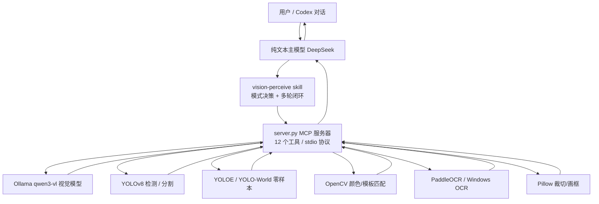

# Local Vision MCP — 架构说明

本文从设计目标出发，讲清楚项目"为什么长这样、各部分怎么协作、怎么扩展"。

## 1. 项目定位

给纯文本大模型（DeepSeek 等）补上"看图"能力的**本地 MCP 服务**：

- **本地优先**：图片文件与视觉识别只在本机完成，不直接上传原图；识别出的文字随对话交给主模型（云端主模型可见）；
- **分工 + 闭环**：把"看图"拆成描述、OCR、检测、分割、定位、裁切等专业工具，再由 skill 编排成多轮闭环，解决单次调用漏细节、位置不准、幻觉的问题；
- **部署友好**：核心 server 零第三方依赖；重型能力（PaddleOCR、YOLOE）做成可选，装不上自动降级。

## 2. 整体架构



一句话：**主模型负责"想"，本地引擎负责"看"，MCP 是桥，skill 是看图的流程规范。**

## 3. 分层设计

| 层 | 组件 | 职责 |
|---|---|---|
| 应用层 | Codex / Claude Code / opencode | MCP 客户端，提供对话与工具调用入口 |
| 编排层 | `vision-perceive` skill | 决定快速/详细模式；按决策树选工具；执行多轮闭环；过滤幻觉 |
| 服务层 | `server.py` | MCP stdio 服务器，12 个工具；基础零依赖，重型能力按需加载 |
| 引擎层 | Ollama / YOLO / YOLOE / World / OpenCV / PaddleOCR / Windows OCR / Pillow | 各自承担一种"看"的能力 |

## 4. 工具清单与职责边界

| 工具 | 引擎 | 输入要点 | 输出 | 适用场景 |
|---|---|---|---|---|
| `analyze_image` | Ollama VLM | file_path / file_paths / mode / prompt | 文字描述 | 看图说话、追问、对比 |
| `compare_images` | Ollama VLM + Pillow | file_paths（≥2） | 拼图后一次对比 | 用户明确要求"对比两张图"时 |
| `image_info` | Pillow | file_path | 尺寸/格式/大小 | 定位前确定坐标系 |
| `ocr_extract` | PaddleOCR / WinOCR | file_path / engine / language | 文本 + 坐标框 | 截图、文档、表格 |
| `vision_status` | 无 | 无 | 配置/依赖/连通性报告 | 排障：连不上、没模型、缺依赖 |
| `detect_objects` | YOLOv8 | file_path / classes / conf | 类别+置信度+框 | COCO 常见物体定位 |
| `segment_objects` | YOLOv8-seg | file_path / classes / conf | 掩膜 + 面积 + 框 | 遮挡数人、面积量算 |
| `detect_by_text` | YOLOE / YOLO-World | file_path / text / conf | 类别+置信度+框 | 任意物体零样本检测 |
| `cv_locate` | OpenCV | mode=color/template | 坐标框 | 色块、图标、logo |
| `crop_image` | Pillow | 区域 + scale | 新图片文件 | 小字/小目标放大 |
| `draw_bounding_box` | Pillow | boxes 数组 | 标注图 | 定位可视化验证 |
| `list_local_models` | Ollama | 无 | 模型列表 | 排障 |

## 5. 数据流（一次典型识图）

### 快速模式（顺手附图）

```
用户附图 → skill 判定为快速模式 → analyze_image(mode=quick)
        → 精简描述返回 → 主模型直接回答（不展开多轮）
```

### 详细模式（认真分析）

```
用户要求详细分析 → image_info 拿尺寸
        → analyze_image(detailed) 概览
        → 聚焦追问 1~3 轮
        → 含文字：ocr_extract（小字先 crop_image 放大）
        → 需定位：detect_objects / segment_objects / detect_by_text / cv_locate
        → draw_bounding_box 画框 → analyze_image 验证框
        → 大图：crop_image 局部放大后再 detailed
        → 交叉校验 → 综合报告
```

## 6. 关键设计决策

| 决策 | 原因 |
|---|---|
| server 基础零依赖 | 降低部署门槛；重型依赖按工具懒加载，装不上就报清晰错误 |
| 定位不用 VLM | qwen3-vl:8b 实测给不出精确坐标；定位交给检测/分割/OpenCV |
| quick / detailed 双模式 | 8B 大模型推理慢（8GB 显存被挤爆、20% 层跑 CPU）；顺手带图必须秒回 |
| PaddleOCR 默认禁 oneDNN/HPI | Paddle 3.x 的 HPI 在 CPU 自动启用 oneDNN 且存在 bug；禁用换稳定（代价是略慢） |
| 结果缓存（内容哈希） | 相同图片+参数直接秒回，避免重复等 20~60s 本地推理；按内容哈希保证文件被替换后自动失效 |
| Ollama 瞬时故障重试 | 429/5xx/网络抖动常见于模型加载期；指数退避重试减少"假故障"；404（模型缺失）不重试 |
| 图片输出带"不可信"前缀 | 图片内文字可能是提示注入；提醒主模型把内容当数据而非指令 |
| vision_status 诊断工具 | "连不上/没模型/缺依赖"类问题一条命令看全，降低排障成本 |
| 输入校验 + 大图缩放默认关 | 本地单用户场景路径白名单过重，只做绝对路径+格式校验；缩放只兜底防卡死，精度靠局部裁切 |
| 权重下载：直连 + 续传 + zip 校验 | 大陆网络访问 GitHub 不稳、代理大文件会截断；坏权重必须能自动识别重下 |
| 后台下载 + 进度返回 | 530MB 权重不能阻塞工具调用，否则体验是"卡死 20 分钟" |
| skill 负责流程而非写死 | 流程可被主模型按需执行、可自定义，不需要改代码 |
| 模型权重不入库 | yolov8*.pt 等为 Ultralytics AGPL-3.0 许可，入库有合规风险 |

## 7. 目录结构

```
vision-mcp-local/
├── server.py                  MCP 服务器（单文件，核心）
├── win_ocr.ps1                Windows 内置 OCR 桥接
├── skills/vision-perceive/    多轮识图 skill（SKILL.md + agents 配置）
├── tests/                     离线单元测试 + 真机冒烟测试
├── benchmarks/                可复现基准测试（合成用例 + 指标报告）
├── docs/
│   ├── 架构说明.md            本文档
│   ├── 部署与常见问题.md      用户向部署手册
│   └── 开发记录与踩坑.md      开发者内部记录
├── install.ps1 / register-mcp.ps1 / install-skill.ps1 / install-extra.ps1
├── check.ps1                  环境自检
├── requirements.txt           可选依赖清单
├── LICENSE                    MIT
├── CHANGELOG.md               版本记录
├── CONTRIBUTING.md            贡献指南
├── ROADMAP.md                 方向与规划（近期做啥 / 明确不做啥）
└── README.md                  项目首页
```

## 8. 依赖矩阵

| 能力 | 依赖 | 必需性 |
|---|---|---|
| MCP 服务 / analyze_image / image_info | Python 标准库 | 必需 |
| ocr_extract（Windows 兜底） | PowerShell 内置 OCR | 必需（Win10+） |
| crop / draw | Pillow | 可选，建议装 |
| cv_locate | numpy + OpenCV | 可选（随 ultralytics 装） |
| detect_objects / segment_objects | ultralytics | 可选 |
| detect_by_text（YOLO-World） | ultralytics | 可选 |
| detect_by_text（YOLOE） | ultralytics + clip fork + mobileclip_blt.ts | 可选 |
| ocr_extract（Paddle） | paddlepaddle + paddleocr | 可选 |

## 9. 扩展点

1. **加一个新工具**：在 `server.py` 的 `TOOLS` 列表加 schema，写 `call_xxx()`，在 `handle_tools_call` 注册；重型依赖懒加载。
2. **换视觉模型**：环境变量 `OLLAMA_VISION_MODEL` / `VISION_MODEL_QUICK`，或调用时传 `model`。
3. **换 OCR 引擎**：`ocr_extract(engine=...)`；在 `_get_paddle_ocr` 后加新引擎分支。
4. **自定义识图流程**：改 skill 的 SKILL.md（决策树/规则），不需要动代码。
5. **限制输出目录**：`VISION_OUTPUT_DIR`。

## 10. 配置项汇总

见 README「配置项（环境变量）」一节；完整排障见《部署与常见问题》。

## 11. 兼容性（换工具 / 换模型 / 换平台）

换客户端（Claude Code / Cursor / Trae / opencode 等）、换主模型（Claude / GPT / Qwen / GLM / Kimi 等）与换视觉模型的完整说明见 README「兼容性」一节；本项目按标准 MCP 协议设计，视觉能力与主模型、客户端解耦。
